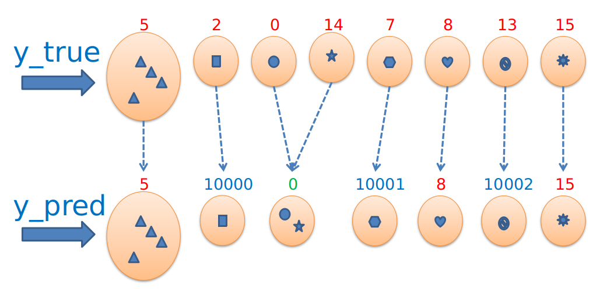

# Python Name Disambiguation Metrics (ND_Metrics)

Metrics implementation in Python for Author Name Disambiguation (AND) evaluation methods.

More information about metrics and details of the algorithms can be found in the following publications:

> Kim, J. "A fast and integrative algorithm for clustering performance evaluation in author name disambiguation." Scientometrics (2019): 661-681, 120(2).

> Amigó, Enrique, et al.: A comparison of Extrinsic Clustering Evaluation Metrics based on Formal Constraints. In: Information Retrieval 12.4 (2009): 461-486.


## Installation

You can simply use `pip` (or any similar package manager) for installation:

    pip install nd-metrics

or, if you prefer a local user installation:

    pip install --user nd-metrics

## Usage

To evaluate any algorithm output you will need **ground-truth data** (also called gold-standard data). We call this the `y_true`. The ground-truth is represented in a:

- (1) dictionary, where the keys are author labels in the gold-standard and the values are sets of annotated categories for those auhor lables. Or; 
- (2) list/numpy 1-d array, where author labels in the gold-standard as list or numpy 1-d array. In this case, the index vector represents the citations of each author.


For example:


```python

# For (1) representation
y_true: {
    1: {0, 1, 2}, 
    2: {3, 4}, 
    3: {5, 6, 7}
}

# For (2) representation
y_true = np.array([1,1,1,2,2,3,3,3])


```

In the above example, key `1` on (1) `y_true` is an author label `1`, with contains three citações in the ground-truth. The same applies to the other keys (`2` and `3`).


The **algorithm output** to be evaluated is called the `y_pred` and is also represented as same cases of `y_true` (ground-truth) 


```python

# For (1) representation
y_pred: {
     1: {0, 1, 2}, 
     2: {3, 4, 5, 6, 7}
}

# For (2) representation
y_pred = np.array([1,1,1,2,2,2,2,2])


```

## Other examples

### Example 2

<!--  -->
<!--  -->


```python

# For representation (1)
y_true = {
     '5': {0, 8, 2, 4}, 
     '2': {1}, 
     '0': {3}, 
    '14': {5}, 
     '7': {6}, 
     '8': {7}, 
    '13': {9}, 
    '15': {10}
}

y_pred = {
        '5': {0, 8, 2, 4}, 
    '10000': {1}, 
        '0': {3, 5}, 
    '10001': {6}, 
        '8': {7}, 
    '10002': {9}, 
       '15': {10}
}

# ------------------------------------------------------------------------------ #

# For representation (2)

y_true = [5,    2,5,0,5,14,    7,8,5,   13,15]

y_pred = [5,10000,5,0,5, 0,10001,8,5,10002,15]


```

### Example 3


### Example 4


Please note that the author names (or keys in dict) **do not need** to be the same as in the ground-truth data because the algorithm only considers the groupings, it does not try to match the names of clusters to the ground-truth labels.


Once you have defined the `y_true` (ground-truth data) and the `y_pred` (algorithm output to evaluate), you can simply do the following to obtain metric values:


```python

from nd_metrics.utils import make_clusters
from nd_metrics.metrics import all_metrics

# true and pred labels as list or numpy 1-d array
y_true = np.array([1,1,1,2,2,3,3,3])
y_pred = np.array([1,1,1,2,2,2,2,2])

# true and pred clusters as dict of sets
y_true_c, y_pred_c = make_clusters(y_true, y_pred)
# y_true_c: {1: set({0, 1, 2}), 2: set({3, 4}), 3: set({5, 6, 7})}
# y_pred_c: {1: set({0, 1, 2}), 2: set({3, 4, 5, 6, 7})}

# all_metrics calculate
all_metrics(y_true_c, y_pred_c)

# output is:

# Metric               P     R     M    
# ClusterFMetric       0.500 0.333 0.400
# KMetric              0.700 1.000 0.837
# BCubedMetric         0.700 1.000 0.824
# SELEMetric           0.000 0.385 0.000
# PairwiseFMetric      0.538 1.000 0.700

```


A simple example can be found in the included `example.py` file, where the examples of the source publication are used.

## License

This software is under the **Apache License 2.0**.

    Licensed under the Apache License, Version 2.0 (the "License");
    you may not use this file except in compliance with the License.
    You may obtain a copy of the License at

        http://www.apache.org/licenses/LICENSE-2.0

    Unless required by applicable law or agreed to in writing, software
    distributed under the License is distributed on an "AS IS" BASIS,
    WITHOUT WARRANTIES OR CONDITIONS OF ANY KIND, either express or implied.
    See the License for the specific language governing permissions and
    limitations under the License.


## How to cite this work

```latex
@misc{Espiridiao2021,
  author = {Espiridiao, L.V.B.},
  title = {Python ND_Metrics},
  year = {2021},
  publisher = {GitHub},
  journal = {GitHub repository},
  howpublished = {\url{https://github.com/lucianovilasboas/nd_metrics}}
}
```